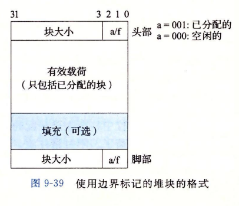
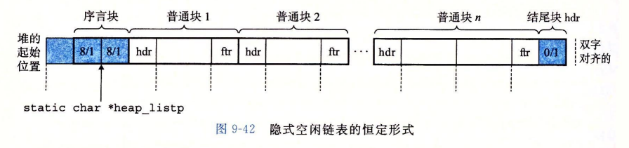
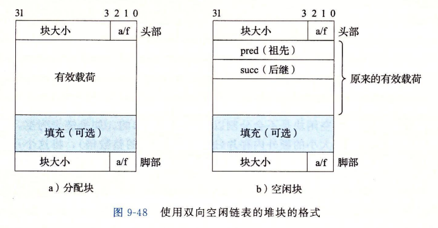

# Malloc Lab
此实验要求实现一个C语言动态内存分配器(a dynamic storage allocator for C programs)，即实现自己版本的：malloc，free，和realloc.

具体实现要求包含以下四个函数：
```c
int   mm_init(void);
void *mm_malloc(size_t size);
void *mm_free(void *ptr);
void *mm_realloc(void *ptr, size_t size);
```

## 实现 I 隐式空闲链表


使用边界标记的block格式如下图所示：

每个block由header，payload，padding(optinal)，footer 组成。header和footer各占一个word，都包含block size 和 分配标识(block size 包含header和footer的大小)。每个block双字(dual words, 8 bytes)对齐,block的最小size 为 两个双字。



序言块 和 结尾块 格式如下：




首先，根据《CSAPP》中9.9.12的样例实现分配器的mm_init(), mm_malloc(), mm_free(), mm_realloc()。 

```C
static char *heap_listp; /* Pointer to first block */

/* 
note: 在此实现中，在mm_init()中不需要使用mem_init()来初始化heap, 
直接用mem_sbrk()来分配内存。 因为在使用mm.c的过程, mem_init()由用户来初始化。 
此lab中 就是由mdriver.c 来调用mem_init()初始化的 
*/

int mm_init(void){
    /*
    利用mem_sbrk()在heap上分配内存;
    初始化 序言block 和 结尾block;
    利用辅助函数extend_heap()扩展 1 page (4k) 大小的内存; 
    */
}

void *mm_malloc(size_t size){
    /*
    搜索空闲的block: find_fit(); 
    如果没有，则扩展heap: expend_heap();
    对找到的block进行分割：place(bp, asize);
    */
}

void *mm_free(void *bp){
    /*
    修改bp对应block的header和footer,标记为空闲；
    合并前后的空闲block: coalesce(); 即，立即合并
    */
}

void *mm_realloc(void *ptr, size_t size){
    /*
    利用mm_malloc()和mm_free()实现；
    首先处理特殊值，ptr==NULL, size == 0;
    新分配一个block，newptr = mm_malloc(size);
    再将原数据赋值到新的block中;
    释放原block, mm_free(ptr);
    return newptr;
    */
}
```

放置策略：此实现的放置策略为首次适配(first fit)，即从头搜索空闲链表，选择第一个合适的空闲块。除此之外，还有：下一次适配(next fit), 最佳适配(best fit);

合并策略：此实现采用的是立即合并，即每次free()一个block时，合并该block前后相邻block. 此外，还有推迟合并，等到一个稍晚时候再合并空闲block.

测试表现：

    Results for mm malloc:
    trace  valid  util     ops      secs  Kops
    0       yes   99%    5694  0.008035   709
    1       yes   99%    5848  0.007198   812
    2       yes   99%    6648  0.012156   547
    3       yes  100%    5380  0.008870   607
    4       yes   66%   14400  0.000105137536
    5       yes   92%    4800  0.007880   609
    6       yes   92%    4800  0.007086   677
    7       yes   55%   12000  0.160954    75
    8       yes   51%   24000  0.303843    79
    9       yes   27%   14401  0.117529   123
    10       yes   34%   14401  0.002695  5343
    Total          74%  112372  0.636350   177
    
    Perf index = 44 (util) + 12 (thru) = 56/100
    
## 实现 II 显式空闲链表+分离适配(segregated fit)


### 显式空闲链表
>显式空闲链表，是在隐式空闲链表的基础上，将空闲块以双向链表的形式组织起来。空闲块中包含前驱指针（pred）和后继指针（succ）。如此，搜索空闲块时的时间由块总数的线性时间减少到了空闲块数量的线性时间。



### 分离适配
>分离的空闲链表，是将单个空闲链表根据空闲块的大小划分为多个空闲链表，组成一个空闲链表数组。分配器维护空闲链表数组，每次分配的时候访问空闲链表数组，依次查找空闲链表查找一个合适的块。如果找不到，就搜索下一个有更大block size的空闲链表。如果找不到，则向系统申请额外的堆内存。找到合适的块后，分割需要的大小，剩下的插入回适当的空闲链表中（根据size）。

## first fit + 分离空闲链表

    Results for mm malloc:
    trace  valid  util     ops      secs  Kops
    0       yes   98%    5694  0.000219 26036
    1       yes   94%    5848  0.000247 23724
    2       yes   98%    6648  0.000241 27574
    3       yes   99%    5380  0.000179 30006
    4       yes   66%   14400  0.000272 53000
    5       yes   89%    4800  0.000371 12955
    6       yes   85%    4800  0.000435 11037
    7       yes   55%   12000  0.000338 35534
    8       yes   51%   24000  0.001092 21976
    9       yes   30%   14401  0.121701   118
    10       yes   45%   14401  0.003794  3796
    Total          74%  112372  0.128887   872

    Perf index = 44 (util) + 40 (thru) = 84/100

## best fit + 分离的空闲链表 + improved realloc
    Results for mm malloc:
    trace  valid  util     ops      secs  Kops
    0       yes   99%    5694  0.000492 11580
    1       yes   99%    5848  0.000248 23552
    2       yes   99%    6648  0.000468 14202
    3       yes  100%    5380  0.000466 11540
    4       yes   66%   14400  0.000342 42130
    5       yes   96%    4800  0.001310  3666
    6       yes   95%    4800  0.001267  3789
    7       yes   55%   12000  0.000590 20329
    8       yes   51%   24000  0.001243 19311
    9       yes   40%   14401  0.000644 22358
    10       yes   45%   14401  0.000445 32333
    Total          77%  112372  0.007515 14953

    Perf index = 46 (util) + 40 (thru) = 86/100
# References
https://zhuanlan.zhihu.com/p/126341872

https://blog.csdn.net/u012336567/article/details/52004250